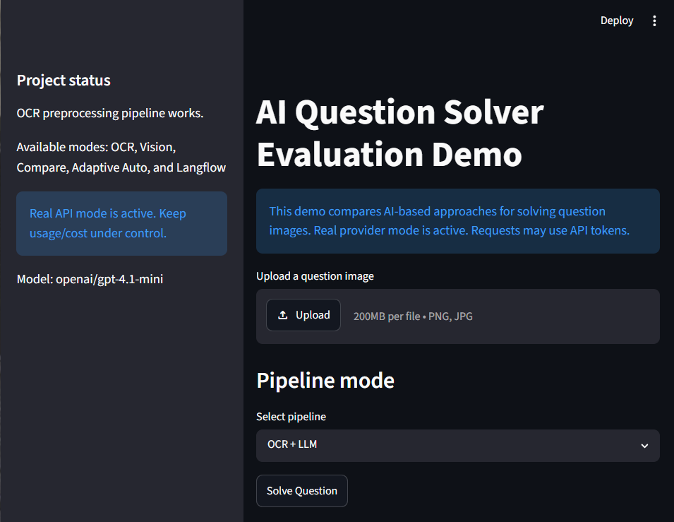
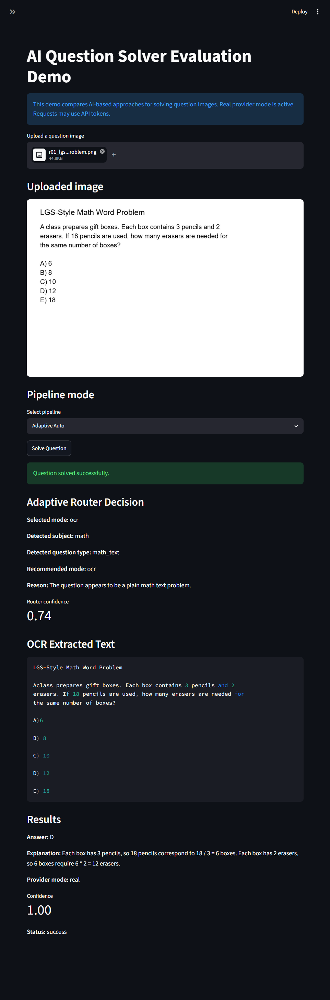
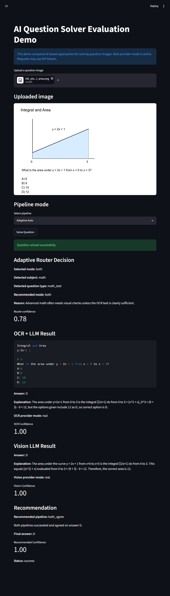
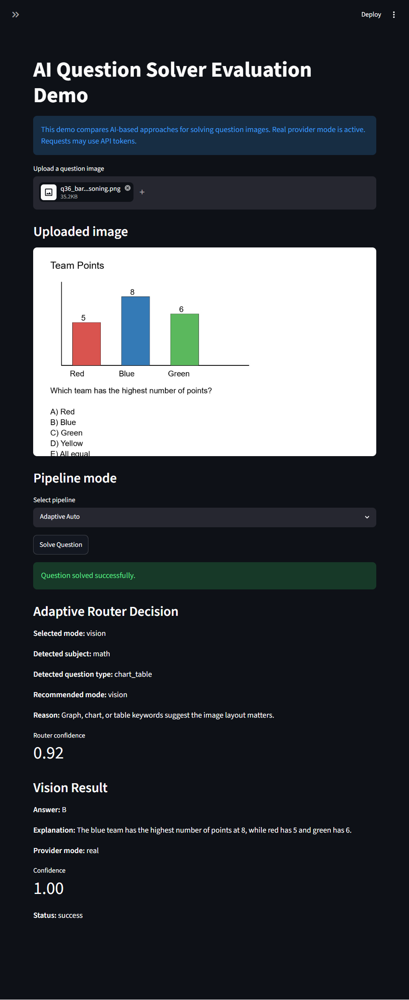
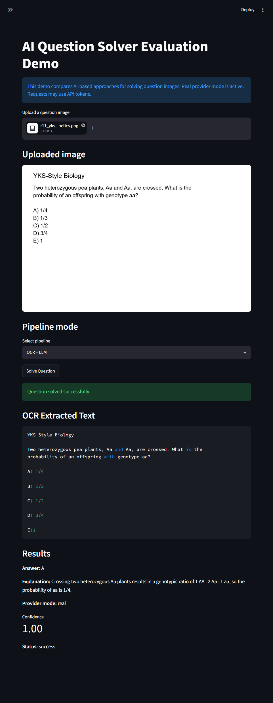
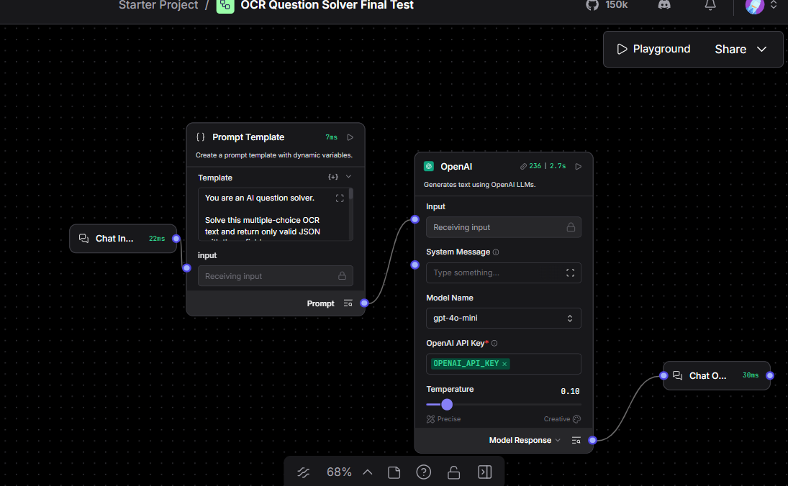
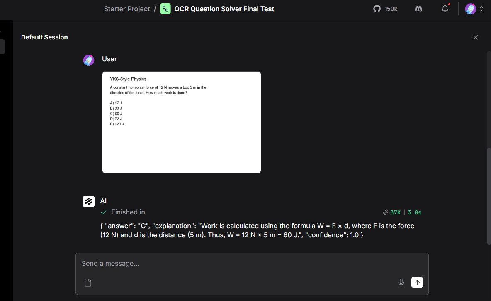
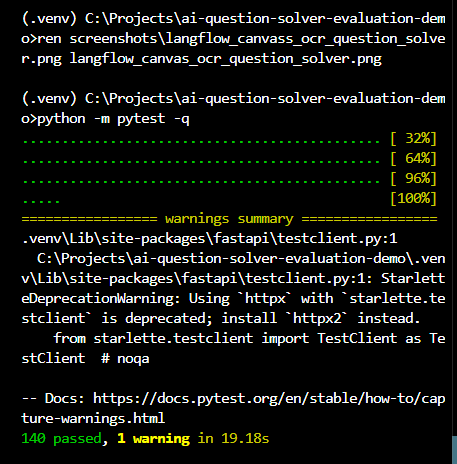
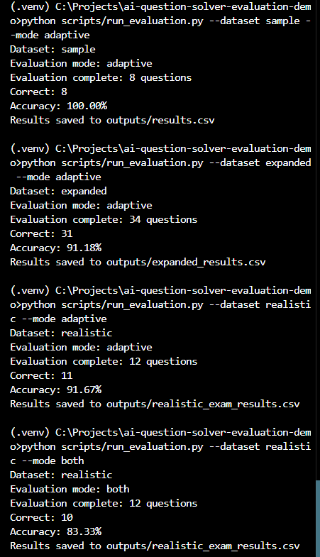

# AI Question Solver Evaluation Demo

## Project Purpose

This repository is a technical demo for evaluating an AI-powered question solving module. It compares several ways to solve question images, from OCR-based text extraction to direct multimodal model calls.

The project was built as a practical technical demo with a backend API, a Streamlit interface, synthetic evaluation datasets, batch evaluation scripts, and screenshots that document the current behavior.

This is not presented as a production-ready exam solver. It is a controlled demo for comparing how different pipelines behave on text-heavy, visual, noisy, and mixed question images.

## What Problem It Solves

Question images can contain plain text, formulas, tables, charts, geometry diagrams, or noisy scan artifacts. A single pipeline is not always best:

- OCR works well when the question is mostly readable text.
- Vision models are often better when the answer depends on visual layout, charts, grids, or geometry.
- Comparing both pipelines can expose disagreement and make the final result easier to inspect.
- An adaptive router can choose a pipeline automatically based on OCR signals.

This project provides a small evaluation environment for comparing those tradeoffs.

## Main Features

- FastAPI backend for image solving.
- Streamlit web UI for manual testing.
- OCR preprocessing pipeline.
- Tesseract OCR integration.
- LLM service with mock mode and real provider mode.
- OpenAI-compatible real provider mode tested with `gpt-4.1-mini`.
- Langflow OCR-text flow integration.
- Adaptive router for selecting OCR, vision, or both.
- Synthetic sample, expanded, benchmark, and realistic exam-style datasets.
- Batch evaluation scripts that save CSV outputs.
- Pytest coverage for routing, parsing, pipelines, API behavior, and evaluation.

## Architecture Overview

```text
app/
  FastAPI app, config, and response schemas

services/
  OCR, preprocessing, LLM calls, solver pipelines,
  adaptive routing, evaluation, and Langflow client

ui/
  Streamlit app for upload-based manual testing

scripts/
  Dataset generation and evaluation scripts

data/
  Synthetic question images and ground truth JSON files

langflow/
  Local Langflow flow export and integration notes

screenshots/
  Evidence screenshots for UI, tests, evaluation, and Langflow

outputs/
  Local runtime CSV results and debug outputs
```

## Pipeline Modes

The solver supports five modes:

1. **OCR + Text LLM**
   - Preprocesses the image.
   - Extracts text with Tesseract.
   - Sends the extracted text to the LLM service.

2. **Vision / Multimodal LLM**
   - Sends the image directly to a vision-capable provider.
   - Useful when layout or diagrams matter.

3. **Both / Compare**
   - Runs OCR + Text LLM and Vision LLM.
   - Compares answers and confidence.
   - Reports the recommended pipeline.

4. **Adaptive Auto Router**
   - Uses OCR text signals to decide between OCR, Vision, or Both.
   - Prioritizes chart, graph, geometry, coordinate-plane, and table indicators before plain math routing.

5. **OCR + Langflow**
   - Sends extracted OCR text to a configured local Langflow flow.
   - Useful for demonstrating an external visual workflow builder alongside the Python backend.

## Dataset Structure

The datasets are synthetic and repo-safe. They are not copied from real LGS, YKS, OSYM, MEB, or other copyrighted exams.

```text
data/ground_truth.json
data/sample_questions/
```

Small smoke-test dataset with 8 simple images.

```text
data/benchmark_ground_truth.json
data/benchmark_questions/
```

Advanced synthetic benchmark questions.

```text
data/expanded_ground_truth.json
data/expanded_questions/
```

Expanded synthetic dataset with Turkish text, social studies, math, calculus, geometry, charts, science, noisy text, and mixed visual reasoning.

```text
data/realistic_exam_ground_truth.json
data/realistic_exam_questions/
```

Original realistic exam-style synthetic dataset with 12 LGS/YKS-inspired items:

- LGS-style math word problem
- LGS-style Turkish paragraph inference
- LGS-style science/chart reasoning
- LGS-style geometry angle problem
- YKS-style derivative question
- YKS-style integral/area question
- YKS-style parabola/graph interpretation
- YKS-style probability question
- YKS-style physics work/energy question
- YKS-style chemistry mole/stoichiometry question
- YKS-style biology/genetics question
- Mixed table reasoning question

## Installation

Create and activate a virtual environment:

```powershell
python -m venv .venv
.\.venv\Scripts\activate
```

Install dependencies:

```powershell
pip install -r requirements.txt
```

Tesseract must also be installed on the machine. The Python package `pytesseract` is only a wrapper; it does not install the OCR engine itself.

## Environment Variables

Create a local `.env` file from the example:

```powershell
copy .env.example .env
```

Common settings:

```env
LLM_MOCK_MODE=true
LLM_MODEL_NAME=
LLM_API_BASE=
LITELLM_PROXY_URL=
USE_LANGFLOW=false
LANGFLOW_URL=
LANGFLOW_FLOW_ID=
```

Do not commit `.env`. Do not put API key values in documentation, screenshots, commits, or shared reports.

## Running the Streamlit UI

Start the UI:

```powershell
streamlit run ui/streamlit_app.py
```

The UI supports:

- OCR + LLM
- Direct Vision LLM
- Both / Compare
- Adaptive Auto
- OCR + Langflow

The project status box is dynamic:

- In mock mode, it says mock mode is active and no API keys are needed.
- In real provider mode, it warns that requests may use API tokens and shows the configured model name if available.
- It does not display API keys.

## Running the FastAPI Backend

Start the backend:

```powershell
uvicorn app.main:app --reload
```

Useful local endpoints:

- `http://127.0.0.1:8000/health`
- `http://127.0.0.1:8000/docs`

The `/solve` endpoint accepts an uploaded image and supports:

- `mode=ocr`
- `mode=vision`
- `mode=both`
- `mode=adaptive`
- `mode=ocr_langflow`

## Running Evaluation Scripts

Run a dataset:

```powershell
python scripts/run_evaluation.py --dataset sample --mode adaptive
python scripts/run_evaluation.py --dataset expanded --mode adaptive
python scripts/run_evaluation.py --dataset realistic --mode adaptive
python scripts/run_evaluation.py --dataset realistic --mode both
```

Available dataset names:

- `sample`
- `benchmark`
- `expanded`
- `realistic`
- `all`

The `all` dataset keeps the original sample, benchmark, and expanded grouping. The realistic dataset is kept separate so existing expectations are not silently changed.

Evaluation CSV files are written under `outputs/`.

## Test Results

Latest known local test result:

```text
140 passed, 1 warning
```

Representative evaluation results:

| Run | Result |
| --- | ---: |
| Sample adaptive | 8/8, 100.00% |
| Expanded adaptive | 31/34, 91.18% |
| Realistic adaptive | 11/12, 91.67% |
| Realistic both | 10/12, 83.33% |

Real provider results may vary slightly between runs because real LLM outputs are not fully deterministic. These results should be read as representative demo results, not as a fixed academic benchmark.

## Screenshots

### Streamlit UI









### Realistic Dataset Example



### Langflow





### Test and Evaluation Evidence





## Langflow Integration

The project includes an optional `ocr_langflow` mode. In this mode:

1. The Python pipeline extracts OCR text from the uploaded image.
2. The OCR text is sent to a configured local Langflow flow.
3. Langflow returns a structured answer result.

The Langflow integration is disabled by default and should be enabled only in local development when the Langflow server and flow ID are configured.

The exported flow and related notes are stored under:

```text
langflow/
```

## Mock Mode vs Real Provider Mode

### Mock Mode

Mock mode is useful for:

- Running tests without external services.
- Demonstrating the pipeline safely.
- Avoiding provider usage.
- Keeping local development predictable.

Set:

```env
LLM_MOCK_MODE=true
```

### Real Provider Mode

Real provider mode is useful for:

- Testing actual model behavior.
- Comparing OCR text solving with direct vision solving.
- Demonstrating the system with OpenAI-compatible providers.

Set:

```env
LLM_MOCK_MODE=false
LLM_MODEL_NAME=openai/gpt-4.1-mini
```

Provider configuration should remain local. Do not commit secrets or private account information.

## Known Limitations

- OCR can lose visual relationships, especially in bar charts, coordinate grids, and geometry diagrams.
- The adaptive router is heuristic. It has improved visual routing, but it is not a trained classifier.
- Mock mode is rule-based and only covers known synthetic patterns.
- Real model outputs can vary slightly between runs.
- The synthetic datasets are useful for evaluation demos, but they are not a substitute for a large, independently curated benchmark.
- Tesseract quality depends on local installation, image quality, font size, and preprocessing.
- Langflow must be running and configured locally for `ocr_langflow` mode.

## Future Improvements

- Add more realistic but original synthetic visual reasoning questions.
- Track latency and token usage per pipeline.
- Add a clearer disagreement review screen in Streamlit.
- Add per-question error categories in evaluation outputs.
- Improve OCR confidence handling for noisy images.
- Add configurable router thresholds.
- Expand Langflow experiments with alternative prompt and parsing nodes.

## Repository Safety Notes

- Do not commit `.env`.
- Do not commit API keys, billing screenshots, or private account information.
- Runtime outputs under `outputs/` are local artifacts.
- Synthetic datasets in `data/` are original generated assets for this demo.
- Screenshots should avoid exposing secrets, private dashboards, or account-specific usage details.
