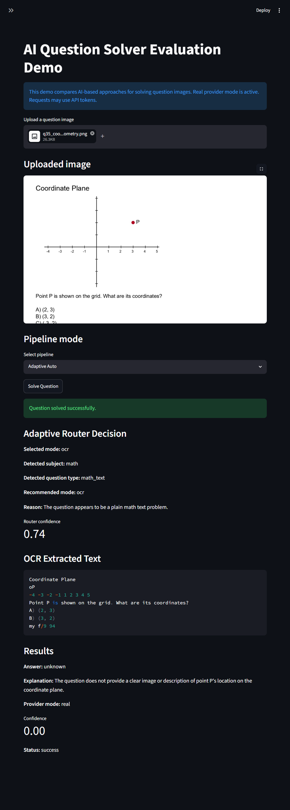
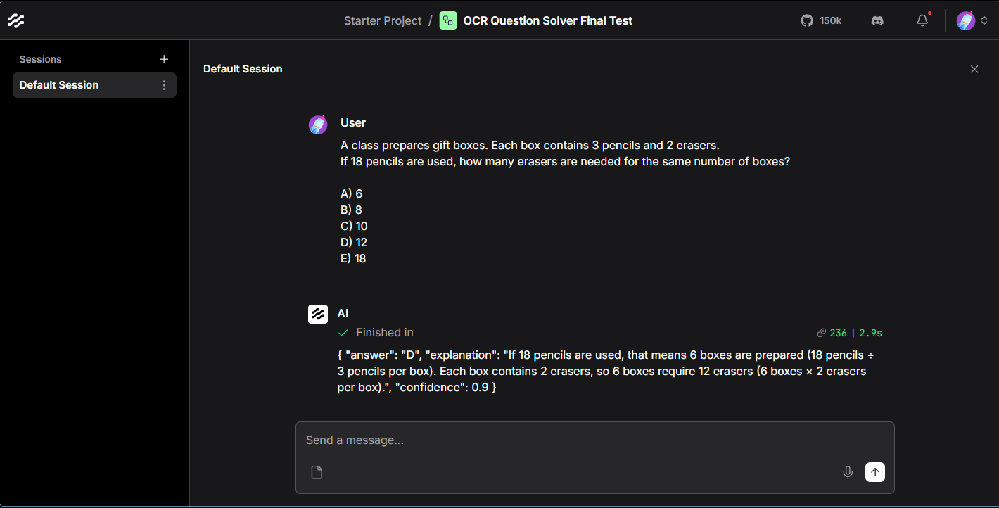

# AI Question Solver Evaluation Demo - Teknik Rapor

## 1. Projenin Amacı

Bu proje, soru görsellerini çözmek için farklı yapay zeka tabanlı yaklaşımları karşılaştırmak amacıyla geliştirildi. Temel amaç, tek bir soru çözme yöntemi yazmaktan çok, aynı problem üzerinde OCR tabanlı ve doğrudan görsel tabanlı yaklaşımların nasıl davrandığını ölçebilmektir.

Bu aşamada proje bir üretim sistemi olarak sunulmuyor. Daha çok, web arayüzü, backend servisleri, Langflow entegrasyonu, sentetik veri setleri ve değerlendirme çıktıları olan kontrollü bir teknik demo olarak ele alınmalıdır.

## 2. İlk İhtiyaç ve Teknik Değerlendirme

Proje, öğrencinin bir soru görseli yükleyip çözüm alabildiği web tabanlı bir soru çözme modülü ihtiyacına göre geliştirildi. Hedef senaryo şuydu: öğrenci web uygulamasına bir soru görseli yükleyecek, sistem bu görseli analiz edecek ve cevabı açıklamasıyla birlikte döndürecek.

İstek içinde Langflow kullanılması da özellikle yer aldı. Ayrıca OpenAI, Gemini veya benzeri temel modellerin kullanılabileceği, bu aşamada maliyetin cevap başarısından daha düşük öncelikte olduğu belirtildi. Bu nedenle yalnızca OCR ile metin çıkarıp çözmek yerine, görseli doğrudan multimodal modele gönderme yaklaşımı da test edildi.

İlk teknik soru şuydu: Görsel doğrudan bir vision modele mi gönderilmeli, yoksa önce OCR ile metin çıkarılıp daha sonra text LLM'e mi çözdürülmeli? Bu iki yaklaşımın güçlü ve zayıf yanları farklı olduğu için projede ikisi de uygulandı ve karşılaştırılabilir hale getirildi.

## 3. Problem Tanımı

Soru görselleri tek tip değildir. Bazı görseller yalnızca düzgün basılmış metinden oluşur. Bazılarında formüller, tablolar, grafikler, geometri çizimleri, koordinat düzlemleri veya düşük kaliteli tarama izleri bulunur.

Bu durum OCR için sorun çıkarabilir. OCR metni okuyabilir, fakat görsel ilişkileri kaybedebilir. Örneğin bir çubuk grafikte sayılar ve etiketler ayrı ayrı okunabilir; fakat hangi çubuğun hangi etikete ait olduğu metinden anlaşılamayabilir.

Projede özellikle şu tür durumlar ele alındı:

- düz metin soruları
- matematiksel ifadeler ve formüller
- tablolar
- grafikler ve çubuk grafikler
- geometri diyagramları
- koordinat düzlemleri
- gürültülü veya düşük kontrastlı görseller
- Türkçe paragraf ve çıkarım soruları
- fen, sosyal, matematik ve karma içerikler

## 4. Genel Mimari

Sistemin genel akışı aşağıdaki gibidir:

```text
Kullanıcı
  |
  v
Streamlit UI veya FastAPI endpoint
  |
  v
Solver Pipeline
  |
  +--> OCR Preprocessing + Tesseract OCR --> Text LLM
  |
  +--> Vision / Multimodal LLM
  |
  +--> Both / Compare
  |
  +--> Adaptive Router
  |
  +--> OCR + Langflow
  |
  v
Cevap, açıklama, güven skoru ve değerlendirme çıktıları
```

Streamlit arayüzü manuel test için kullanıldı. FastAPI backend, aynı çözüm mantığını API üzerinden çalıştırmak için hazırlandı. OCR preprocessing kısmı görseli OCR'a daha uygun hale getirir. Tesseract OCR metni çıkarır. LLM servisi mock veya gerçek provider modunda çalışabilir. Solver pipeline, seçilen moda göre OCR, vision, both, adaptive veya Langflow akışını çalıştırır.

Değerlendirme scriptleri ground truth dosyalarını okuyup sonuçları CSV olarak `outputs/` altında üretir.

## 5. Kullanılan Teknolojiler

- **Python:** Projenin ana geliştirme dili.
- **FastAPI:** Görsel yükleme ve soru çözme endpointleri için backend framework.
- **Streamlit:** Manuel demo ve test arayüzü.
- **OpenCV:** OCR öncesi görsel işleme adımları.
- **Tesseract OCR:** Görselden metin çıkarma.
- **OpenAI uyumlu LLM çağrıları:** Gerçek provider modunda `gpt-4.1-mini` ile text/vision testleri yapıldı.
- **Langflow:** OCR metnini görsel bir akış üzerinden modele göndermek için test edildi.
- **pytest:** Otomatik testler.
- **pandas:** Değerlendirme sonuçlarını CSV olarak üretmek ve okumak için kullanıldı.

## 6. Pipeline Modları

### OCR + LLM

Bu modda önce görselden metin çıkarılır, sonra bu metin LLM servisine gönderilir. Metin tabanlı sorularda hızlı ve anlaşılır bir yaklaşımdır. Türkçe paragraf, basit matematik ve açık yazılmış fen sorularında iyi çalışabilir.

Zayıf tarafı, görsel ilişki gerektiren sorulardır. Grafik, koordinat düzlemi veya geometri çizimlerinde OCR metni okuyabilir ama çizimin anlamını kaybedebilir.

### Vision LLM

Bu modda görsel doğrudan multimodal modele gönderilir. Grafik, geometri, tablo ve görsel düzen içeren sorularda daha mantıklıdır.

Zayıf tarafı, bazı metin ağırlıklı sorularda OCR + text yaklaşımına göre daha değişken cevaplar üretebilmesidir. Ayrıca gerçek provider modunda maliyet ve gecikme daha önemli hale gelir.

### Both / Compare

Bu mod OCR + LLM ve Vision LLM sonuçlarını birlikte çalıştırır. İki sonuç aynıysa güven artar. Farklıysa pipeline, cevap güveni ve bazı onarım kuralları üzerinden öneri üretir.

Bu mod, değerlendirme ve hata analizi için faydalıdır. Ancak iki model çağrısı gerektirdiği için gerçek provider modunda maliyeti artırabilir.

### Adaptive Auto

Adaptive Auto, OCR metnindeki sinyallere bakarak OCR, Vision veya Both seçer. Örneğin düz metin veya Türkçe paragraf sorularında OCR seçebilir. Grafik, tablo, koordinat düzlemi ve geometri sinyallerinde Vision seçmesi beklenir.

Bu mod üretim seviyesinde bir sınıflandırıcı değildir. Kural tabanlı, okunabilir ve test edilebilir bir router olarak yazıldı.

### OCR + Langflow

Bu modda önce OCR metni çıkarılır, sonra metin Langflow'daki yerel akışa gönderilir. Langflow tarafında Chat Input, Prompt Template, OpenAI node ve Chat Output bileşenleriyle soru çözme akışı test edildi.

Langflow entegrasyonu, web tabanlı soru çözme demo isteğinde görsel akış desteği de beklendiği için projeye eklendi. Çekirdek Python pipeline'dan ayrı tutulduğu için Langflow çalışmasa bile diğer modlar kullanılabilir.

## 7. Adaptive Router Mantığı

Adaptive router, her soru için aynı pipeline'ı kullanmanın yeterli olmaması nedeniyle eklendi. Router, OCR metnindeki anahtar kelimelere ve bazı görsel sinyallere bakarak karar verir.

Genel mantık şu şekildedir:

- düz metin ve basit matematik -> OCR
- Türkçe paragraf ve çıkarım soruları -> OCR
- chart, graph, table, coordinate, grid, point P, geometry gibi sinyaller -> Vision
- OCR güveni düşük veya durum belirsizse -> Both
- ileri matematik veya görsel bağlam gerektiren ifadeler -> Vision veya Both

Router bir makine öğrenmesi sınıflandırıcısı değildir. Kural tabanlıdır. Bu sayede davranışı testlerle takip edilebiliyor.

Önemli bir örnek `q36` chart sorusudur. İlk durumda OCR şu tip bir metin çıkarıyordu:

```text
8 6 5 Red Blue Green
```

Bu metin sayıları ve etiketleri ayrı ayrı içerdiği için model görsel ilişkiyi kaybedip yanlış cevap verebiliyordu. Router daha sonra chart/table/grafik sinyallerini matematik metni sınıflandırmasından önce değerlendirecek şekilde iyileştirildi. Bu değişiklikten sonra `q36` Vision moduna yönlendirildi ve doğru cevap olan B döndü.

## 8. Dataset Hazırlığı

Projede birkaç farklı sentetik veri seti kullanıldı.

### sample

Basit smoke-test veri setidir. OCR, vision, both ve adaptive pipeline'ların temel olarak çalıştığını görmek için kullanıldı.

### benchmark

Daha ileri seviye sentetik sorular içerir. Parabol, türev, limit, integral, geometri ve grafik soruları gibi daha zor örnekler barındırır.

### expanded

Türkçe metin, sosyal bilgiler, matematik, geometri, grafik, tablo, fen, gürültülü görsel ve karma soru tiplerini kapsar. Adaptive router iyileştirmeleri bu veri seti üzerinde daha net gözlemlendi.

### realistic exam-style

Bu veri seti, LGS/YKS tarzından esinlenen fakat gerçek sınavlardan kopyalanmayan özgün sentetik sorulardan oluşur. Gerçek LGS/YKS, ÖSYM veya MEB soruları kullanılmadı. Amaç, kontrollü sample ve benchmark setlerinin ötesine geçip daha gerçekçi formatları test etmektir.

Sample ve benchmark veri setleri ilk geliştirme için yeterliydi, ancak görsel akıl yürütme ve daha uzun metinli sorular için yeterince zorlayıcı değildi. Bu nedenle realistic exam-style veri seti eklendi.

## 9. Evaluation Süreci

Değerlendirme süreci ground truth JSON dosyaları üzerinden çalışır. Her kayıtta soru görselinin yolu, soru tipi ve doğru cevap bulunur.

Komut örneği:

```powershell
python scripts/run_evaluation.py --dataset expanded --mode adaptive
```

Script şu adımları izler:

1. Seçilen veri setinin ground truth JSON dosyasını okur.
2. Her soru için belirtilen pipeline modunu çalıştırır.
3. Model cevabını doğru cevapla karşılaştırır.
4. Sonuçları CSV olarak `outputs/` klasörüne yazar.
5. Toplam doğru sayısını ve doğruluk oranını raporlar.

Temsilî sonuçlar:

| Değerlendirme | Sonuç |
| --- | ---: |
| Sample adaptive | 8/8, 100.00% |
| Expanded adaptive | 31/34, 91.18% |
| Realistic adaptive | 11/12, 91.67% |
| Realistic both | 10/12, 83.33% |

Bu değerler son proje durumu için seçilen temsilî çalıştırmadan alınmıştır; test sırasında real provider modunda bazı sonuçların koşudan koşuya değişebildiği gözlemlendi.

Gerçek LLM provider modunda sonuçlar küçük farklılıklar gösterebilir. Modeller tamamen deterministik cevap üretmediği için bu değerler sabit akademik benchmark sonucu olarak değil, temsilî demo/evaluation çıktıları olarak okunmalıdır.

### Model Comparison Benchmark

GPT Web UI, Gemini Web UI, Claude Web UI ve yerel tool sonucunu karşılaştırmak için 20 soruluk YKS/TYT-AYT stili ek bir benchmark hazırlandı. Set 10 matematik ve 10 fizik sorusundan oluşur.

Son karşılaştırma sonucu:

| Sistem | Doğru | Başarı |
| --- | ---: | ---: |
| GPT Web UI | 20/20 | 100% |
| Gemini Web UI | 19/20 | 95% |
| Claude Web UI | 19/20 | 95% |
| Local Tool | 17/20 | 85% |

Sonuçlar şu dosyalarda tutulur:

- `reports/model_comparison_template.csv`
- `reports/comparison_tool_results.csv`
- `reports/model_comparison_final_report.md`

Bu karşılaştırma, model akıl yürütme hatalarını OCR/parsing kaynaklı hatalardan ayırmaya yardımcı olur.

## 10. Streamlit UI Testleri

Streamlit arayüzünde manuel testler yapıldı. Arayüzde provider modu görünür hale getirildi. `.env` içinde `LLM_MOCK_MODE=false` olduğunda UI artık mock mode mesajı göstermiyor; gerçek provider modunda token kullanımına dikkat edilmesi gerektiğini belirtiyor ve model adını gösteriyor.

Manuel olarak test edilen örnekler:

- gerçek provider modunun arayüzde doğru görünmesi
- OCR + LLM ile biyoloji/genetik sorusu
- Adaptive Auto ile matematik kelime problemi
- Adaptive Auto ile görsel chart sorusu
- Both/Compare ile integral sorusu
- koordinat/geometri gibi sınırlılık örnekleri

Örnek ekran görüntüleri:




## 11. Langflow Entegrasyonu

Langflow yerel olarak kuruldu ve çalıştırıldı. Test edilen temel akış şu yapıdaydı:

```text
Chat Input -> Prompt Template -> OpenAI -> Chat Output
```

Python tarafında OCR ile çıkarılan metin `ocr_langflow` modunda Langflow'a gönderilebiliyor. Son durumda temiz bir Langflow flow oluşturuldu, OpenAI node ile test edildi ve JSON formatında cevap döndürebildi.

Langflow tarafında birkaç pratik sorunla karşılaşıldı:

- Prompt Template içinde ham JSON örneği yazıldığında `{ "answer": ... }` gibi süslü parantezler değişken sanıldı. Bu nedenle prompt, ham JSON bloğu yerine alanları tarif edecek şekilde düzenlendi.
- İlk Langflow flow/session bazı durumlarda boş output döndürdü, fakat OpenAI API ayrı test edildiğinde çalışıyordu.
- Langflow yerel oturum ve auth kaynaklı sorunları azaltmak için gerekli environment değişkenleriyle başlatıldı. Örneğin `OPENAI_API_KEY` ve `LANGFLOW_SKIP_AUTH_AUTO_LOGIN=true` kullanıldı.
- Sonrasında temiz, minimal bir flow yeniden kuruldu ve başarılı şekilde test edildi.

Ekran görüntüleri:




## 12. Karşılaşılan Hatalar ve Çözümler

### Virtual environment aktif değildi

İlk çalıştırmalarda sanal ortam aktif olmadığı için FastAPI import hatası alındı. Ortam aktif edilip bağımlılıklar doğru Python ortamına kurulunca sorun çözüldü.

### Gerçek provider çıktıları değişebiliyordu

Gerçek LLM cevapları bazı çalıştırmalarda küçük farklılıklar gösterdi. Bu nedenle raporda sonuçlar temsilî çalıştırmalar olarak verildi.

### q36 chart routing sorunu

`q36` sorusunda OCR sayıları ve etiketleri ayrı çıkardığı için görsel ilişki kayboldu. Router ilk durumda bu soruyu düz matematik/metin gibi değerlendirdi. Chart/table sinyalleri önce değerlendirilecek şekilde router iyileştirildi.

### Langflow JSON braces sorunu

Prompt Template içinde JSON süslü parantezleri değişken gibi algılandı. Prompt daha sade hale getirildi ve alanlar açıklama olarak yazıldı.

### Langflow boş output sorunu

Var olan flow bazı denemelerde boş çıktı döndürdü. Temiz ve minimal bir flow yeniden kuruldu. OpenAI node ile doğrudan test edildi.

### Git ve dosya temizliği

`.env`, runtime outputs, uploads ve cache dosyaları repoya alınmadı. Windows üzerinde CRLF uyarıları görüldü, fakat bunlar çalışmayı engelleyen hatalar değildi.

### Screenshot klasörü

Ekran görüntüleri bir aşamada yanlışlıkla iç içe klasöre taşındı. Daha sonra klasör yapısı temizlendi ve raporda kullanılacak dosyalar `screenshots/` altında toplandı.

## 13. Güvenlik ve Repo Temizliği

Bu projede gizli bilgiler repoya eklenmemelidir.

Alınan önlemler:

- `.env` commit edilmedi.
- API key değerleri dokümana veya ekran görüntülerine yazılmadı.
- `outputs/` yerel çalışma çıktısı olarak ele alındı.
- `uploads/` yüklenen kullanıcı dosyaları için yerel klasör olarak bırakıldı.
- cache dosyaları repoya dahil edilmedi.
- Langflow export dosyaları key sızıntısı açısından kontrol edildi.
- OpenAI kullanım veya billing ekran görüntüleri repoya eklenmedi.

## 14. Sonuçların Değerlendirilmesi

Sonuçlar, tek bir yöntemin tüm soru tiplerinde en iyi seçenek olmadığını gösterdi. OCR okunabilir metin sorularında iyi çalışıyor. Vision yaklaşımı ise grafik, geometri ve koordinat ilişkisi içeren sorularda daha mantıklı hale geliyor.

Both/Compare modu, OCR ve Vision cevaplarını birlikte görmek için faydalı oldu. Adaptive router da manuel seçim yükünü azaltıyor. Ancak router hâlâ kural tabanlı olduğu için tüm durumları kusursuz yakalaması beklenmemelidir.

Realistic veri seti, kontrollü sample sorularına göre daha zorlayıcıdır. Bu nedenle başarısız örnekler de proje için faydalı oldu; hangi soru tiplerinde OCR, vision veya routing tarafında iyileştirme gerektiğini gösterdi.

Bu haliyle proje güçlü bir değerlendirme/demo temelidir. Üretim sistemi olarak kullanılması için daha geniş veri, daha iyi güven kalibrasyonu, maliyet takibi ve daha sağlam hata yönetimi gerekir.

## 15. Bilinen Sınırlılıklar

- Tesseract OCR düşük kaliteli görsellerde veya karmaşık yerleşimlerde hata yapabilir.
- Bazı geometri ve koordinat soruları daha güçlü görsel akıl yürütme gerektirir.
- Adaptive router kural tabanlıdır, eğitilmiş bir sınıflandırıcı değildir.
- Gerçek LLM çıktıları çalıştırmadan çalıştırmaya değişebilir.
- Veri setleri sentetik ve küçüktür.
- Cost, token ve latency takibi henüz tam kapsamlı değildir.
- Langflow entegrasyonu yerel kurulum ve doğru environment ayarlarına bağlıdır.

## 16. Sonraki Geliştirmeler

- Daha fazla özgün ve gerçekçi soru eklemek.
- Görsel akıl yürütme için daha güçlü bir test veri seti hazırlamak.
- Token, maliyet ve latency loglarını pipeline bazında tutmak.
- Streamlit içinde OCR/Vision uyuşmazlıklarını daha açık gösteren bir ekran eklemek.
- Router eşiklerini konfigüre edilebilir hale getirmek.
- Güven skoru kalibrasyonunu iyileştirmek.
- Langflow tarafında farklı prompt ve parser node'ları denemek.
- Gemini veya başka vision provider'larla karşılaştırma yapmak.

## 17. Kısa Sonuç

Bu proje şu anda web tabanlı bir soru görseli çözme demosu olarak çalışır durumdadır. OCR, vision, adaptive routing, real provider testleri, Langflow flow, sentetik veri setleri, ekran görüntüleri ve otomatik testler aynı repo içinde toplanmıştır.

Sistem üretim hazır bir sınav çözücü olarak sunulmuyor. Ancak farklı soru görseli çözme yaklaşımlarını karşılaştırmak, hataları görmek ve sonraki geliştirmeleri planlamak için kullanılabilir bir teknik temel oluşturuyor.
